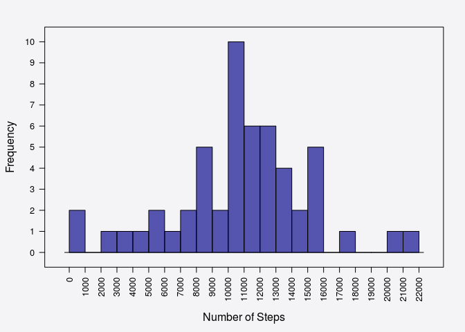
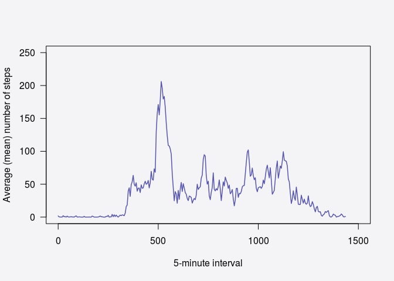
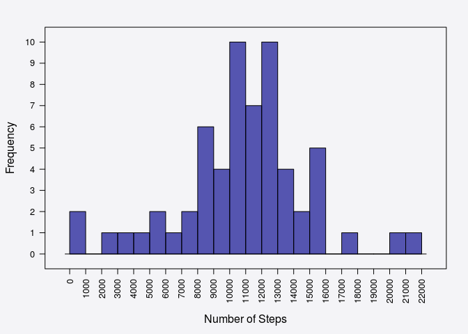
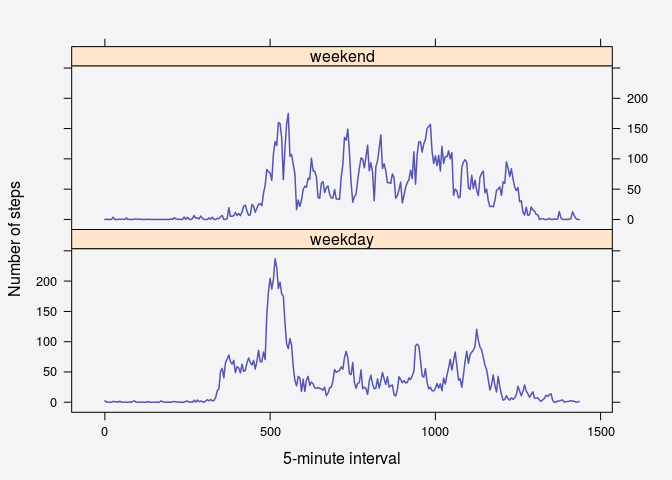

# Reproducible Research - Peer Assessment 1
ofcoursera  
14 October 2015  

## Introduction

### Aim
The aim of the assignment was to perform exploratory analysis of data acquired from 
a personal activity monitoring device, as specified for Coursera 
Reproducible Research Peer-Assessment 1 [RDPeng, 2014][1].

### Data
The dataset analysed consists of counts of the total number of steps taken by a 
single anonymous individual, collated at 5-minute intervals throughout each day, over the
course of October 2012 and November 2012.  

See [Appendix 1](#Appendix 1) for an example of 5-minute interval notation over the course of a single day (1st October 2012).

The data was sourced from a single comma-separated-value file (activity.csv, [351 KB]), 
of 17,568 observations, 3 columns, and a single header row, with missing values coded as NA.


The variables included are:

-   steps: Number of steps taking in a 5-minute interval (missing values are coded as NA)
-   date: The date on which the measurement was taken in YYYY-MM-DD format  
    -  total number of dates included = 31 Oct + 30 Nov = 61  
-   interval: Identifier for the 5-minute interval in which measurement was taken  
    -  total number of intervals per day = (24 * 60) / 5 = 288  
    -  total number of intervals per hour = (60 / 5) = 12
    -  intervals are recorded using 24-hour time notation 

This can be downloaded from the course website: [repdata_data_activity.zip [52KB\]][2]


### Submission

The following items have been submitted for peer review:  

-   Committed to GitHub:
    -   PA1_template.Rmd
    -   PA1_template.md
    -   PA1_template.html
    -   figure/  directory containing figures
-   Submitted to Coursera:
    -   URL to GitHub repository
    -   SHA-1 hash for the submitted commit  


This R markdown document can be processed by knitr and be transformed into an HTML file, to display both the completed
analysis and the code used to perform that analysis required for this assignment.

Base and lattice plotting systems have been used to generate graphic elements required for the assignment.  


***

## Analysis Part 1 - Environment Setup

### Required packages
1. knitr
2. lattice
3. rmarkdown

#### Packages can be installed as follows

<!-- comment: display as non-executable code) --> 

```S
install.packages("knitr")
install.packages("rmarkdown")
install.packages("lattice")
```

***

### Loading and preprocessing the data

Load libraries.


```r
# load libraries  
library(knitr)
library(rmarkdown)
library(lattice)
```

Set global variables.


```r
# Global variables
opts_chunk$set(echo=TRUE, fig.align="center", dev.args=list(bg=rgb(0.95, 0.95, 0.96, 0.8)))
```

Define functions to format output for reporting.


```r
# define function to format intervals to 24-hour time
fmt_interval <-function(x){
    n <- nchar(x)
    a <- substring(x, first=c(1), last=c(n-2))
    b <- substring(x, first=c(n-1), last=c(n))
    c <- ifelse (as.integer(a) < 12, "am","pm") 
    d <- paste0(a, ":", b," ",c)
    return (d)
}
```


```r
# define function to round and insert commas for reporting 
fmt_rounded_big_mark <- function(x){
    format(round(x,0), big.mark=",", scientific=FALSE)
}
```


```r
# define function to calculate and round percentage for reporting 
fmt_rounded_pc <- function(dividend, divisor, diff=FALSE, digits=0, sci=FALSE){
    pc <- (dividend / divisor) * 100
    if (diff==TRUE) { pc <- pc - 100 }
    pc <- format(round(pc, digits), scientific=sci)
    return (pc)
}
```

Read in activity dataset using class "csvDate" to specify date format. 


```r
# Set import date format
setClass("csvDate")
setAs("character","csvDate", function(from) as.Date(from, format="%Y-%m-%d") )

# Check if file exists, else unzip
if (!file.exists("activity.csv")) {
    if (file.exists("activity.zip")) 
        { unzip("activity.zip", files = "activity.csv", unzip = getOption("unzip")) }
    else
        { unzip("repdata_data_activity.zip", files = "activity.csv", unzip = getOption("unzip")) }
}
```

```
## arguments 'minimized' and 'invisible' are for Windows only
```

```r
# Read in data  
activity <- read.csv("activity.csv", header=TRUE, colClasses = c("integer","csvDate","integer"))
```

***

## Analysis Part 2 - Exploratory Analysis Excluding NAs

### What is mean total number of steps taken per day?  
#### 1. Calculate the total number of steps taken per day.  

The total number of steps taken per day were calculated by summing steps aggregated by date, whilst excluding groups where all data entries for steps taken were NA.


```r
# Aggregate the total number of steps taken by date
# excluding groups where all returns are NA
stepsTot <- aggregate(steps ~ date, data=activity, FUN=sum, na.rm=TRUE, na.action = na.omit)
colnames(stepsTot) <- c("Date","TotNoSteps")
```

#### 2. Histogram of the total number of steps taken each day.  

A histogram plot of the total number of steps taken per day was generated using the lattice package.  

<!-- comment: Add hyper link) --> 
<a name="Figure 1"></a>


```r
# generate histogram plot and store 
h1x <- "Number of Steps"
h1y <-"Frequency"
h1breaks <- 20
h1yat <- seq(0, 12, 1)
h1xat <- seq(0, 22000, 1000)
histogram(stepsTot$TotNoSteps, breaks=h1breaks, scales=list(y=list(at=h1yat), 
            x=list(at=h1xat, rot=90), tck =c(1,0)), xlab=h1x, ylab=h1y, 
            type="count", col=rgb(0/255, 0/255, 139/255, 0.65))
```



<center> **Figure 1:** Histogram of the total number of steps taken per day. </center>  

#### 3. Calculate and report the mean and median of the total number of steps taken per day.  

The mean and median of the total number of steps aggregated by date were calculated, then rounded to the nearest whole step for reporting.


```r
# round to the nearest step
stepsMean <- mean(stepsTot$TotNoSteps, na.rm=TRUE)
stepsIQR25<- quantile(stepsTot$TotNoSteps, na.rm=TRUE)[[2]]
stepsMedian <- quantile(stepsTot$TotNoSteps, na.rm=TRUE)[[3]]
stepsIQR75 <- quantile(stepsTot$TotNoSteps, na.rm=TRUE)[[4]]

# format for report - rounded with commas
stepsMean.f <- fmt_rounded_big_mark(stepsMean)
stepsMedian.f <- fmt_rounded_big_mark(stepsMedian)
stepsIQR25.f <- fmt_rounded_big_mark(stepsIQR25)
stepsIQR75.f <- fmt_rounded_big_mark(stepsIQR75)
```

The mean of the total number of steps taken per day is **10,766**.  
The median of the total number of steps taken per day is **10,765**.  

***

### What is the average daily activity pattern?  
#### 1. Make a time series plot (i.e. type = "l") of the 5-minute interval (x-axis) and the average number of steps taken, averaged across all days (y-axis).


```r
# average number of steps taken, across all days, by 5-minute interval
# excluding interval groups where all step returns are NA
stepsAvrg <- aggregate(steps ~ interval, data=activity, FUN=mean, na.rm=TRUE, na.action = na.omit)
colnames(stepsAvrg) <- c("Interval","AvrgNoSteps")
```

A time series plot, showing the average number of steps taken averaged across all days, was generated as a line plot using lattice.

Time intervals were derived from row index to provide a uniform scale, as the activity dataset uses a modified 24-Hour time format to record intervals [Appendix 1](# Appendix 1)

<!-- comment: Add hyper link) --> 
<a name="Figure 2"></a>


```r
# plot average number of steps taken, by 5-minute interval, across all days
# using interval index (row name), to generate x-axis scale
p1x <- "5-minute interval"
p1y <- "Average (mean) number of steps"
iint <- (as.integer(rownames(stepsAvrg)) - 1) * 5

with(stepsAvrg, plot(iint, AvrgNoSteps, type = "l", ylab=p1y, xlab=p1x, xlim = c(0, 1500),
            ylim = c(0, 250), yaxt="n",  lwd = 1.5, col=rgb(0/255, 0/255, 139/255, 0.65)))

axis(side=2, las=2)
```



<center> **Figure 2:** Time series showing the average (mean) number of steps taken (averaged across all days), by 5-minute interval. </center>  


#### 2. Which 5-minute interval, on average across all the days in the dataset, contains the maximum number of steps?


```r
# extract interval with max average no. of steps, rounded to nearest step
imaxsteps <- stepsAvrg[stepsAvrg$AvrgNoSteps == max(stepsAvrg$AvrgNoSteps),]
imaxsteps[2] <- round(imaxsteps[1,2],0)

# extract interval no
ivalno <- rownames(imaxsteps)

# derive max time limit for the interval, by adding 5 mins
irangelim <- imaxsteps[1] + 5

# format the time interval as time [24-hour time]
istart.f <- fmt_interval(imaxsteps[1,1])
iend.f <- fmt_interval(imaxsteps[1] + 5)
```

The **104 th** 5-minute interval (**8:35 am** to **8:40 am**), averaged across all the days in the dataset, contains the maximum number of steps (**206**).  

***

## Analysis Part 3 - Exploratory Analysis Including Imputed Values for Missing Observations.

### Imputing missing values.

Note that there are a number of days/intervals where there are missing values (coded as NA). The presence of missing days may introduce bias into some calculations or summaries of the data.  

#### 1. Calculate and report the total number of missing values in the dataset (i.e. the total number of rows with NAs).


```r
# count missing values
totnas <- sum(is.na(activity))
totrows <- nrow(activity)
pcnas <- round(((totnas/totrows) * 100),0)
totnonnas <- (totrows - totnas)

# format for report - rounded with commas
totnonnas.f <- fmt_rounded_big_mark(totnonnas)
totnas.f <- fmt_rounded_big_mark(totnas)
totrows.f <- fmt_rounded_big_mark(totrows)
```

The total number of missing values (rows containing NAs) in the activity dataset = **2,304** (**13%**) of **17,568** observations.  

#### 2. Devise a strategy for filling in all of the missing values in the dataset. 

The strategy does not need to be sophisticated. For example, you could use the mean/median for that day, or the mean for that 5-minute interval, etc.  

**Strategy:** replace missing step values with the mean number of steps (rounded to the nearest step) for that 5-minute time interval, grouped by day of the week.

1. Aggregate steps by day of the week by interval
2. Merge aggregated values to activity dataset by outer join using merge
3. append merged activity dataset with imputed steps column
    - if activity steps is NA, value is aggregated value
    - if activity steps is not NA, value is original value  

#### 3. Create a new dataset from the original dataset, with the missing data filled in.


```r
# build index for intervals
impiint <- rep(seq(1,288,1),61)
impiint <- (impiint -1 ) *5

activity <- cbind(activity,impiint)


# derive mean of steps aggregated on time interval and day of the week
stepsAvrgDate <- aggregate(steps ~ weekdays(date) + impiint, data=activity, 
                           FUN=mean, na.rm=TRUE, na.action = na.omit)

colnames(stepsAvrgDate) <- c("day","impiint","avgNoSteps")

# append activity dataset with day of the week derived from date
activity$day <- weekdays(activity$date)

# outer join activity data set with aggregated steps data frame
impactivity <- merge(activity, stepsAvrgDate, by.x=c("day","impiint"), 
                     by.y=c("day","impiint"), all=TRUE)

# populate imputed steps column with aggregated value if original value is NA, 
# else with original value 
impactivity$impsteps <- mapply(FUN = function(x, y) ifelse(is.na(x) == TRUE,y,x), 
                            impactivity$steps, round(impactivity$avgNoSteps,0))
```

#### 4.1 Make a histogram of the total number of steps taken each day.

Calculate the total number of steps taken per day for data including imputed values for missing observations.


```r
# Calculate the total number of steps taken per day on imputed dataset
impstepsTot <- aggregate(impsteps ~ date, data=impactivity, FUN=sum, na.rm=TRUE, na.action = na.omit)
colnames(impstepsTot) <- c("Date","TotNoImpSteps")
```

Lattice is used to generate a histogram plot showing the distribution of the mean number of steps taken per day, following the replacement of missing observations with imputed values. 

<!-- comment: Add hyper link) --> 
<a name="Figure 3"></a>


```r
# generate histogram plot and store 
h2x <- "Number of Steps"
h2y <- "Frequency"
h2breaks <- 20
h2yat <- seq(0, 12, 1)
h2xat <- seq(0, 22000, 1000)
histogram(impstepsTot$TotNoImpSteps, breaks=h2breaks, scales=list(y=list(at=h2yat), 
            x=list(at=h2xat, rot=90), tck =c(1,0)), xlab=h2x, ylab=h2y, 
            type="count", col=rgb(0/255, 0/255, 139/255, 0.65))
```



<center> **Figure 3:** Histogram of the total number of steps taken per day, following imputation of missing observations. </center>  


#### 4.2 Calculate and report the mean and median of the total number of steps taken per day.


```r
# round to the nearest step
impStepsMean <- mean(impstepsTot$TotNoImpSteps, na.rm=TRUE)
impStepsIQR25 <- quantile(impstepsTot$TotNoImpSteps, na.rm=TRUE)[[2]]
impStepsMedian <- quantile(impstepsTot$TotNoImpSteps, na.rm=TRUE)[[3]]
impStepsIQR75 <- quantile(impstepsTot$TotNoImpSteps, na.rm=TRUE)[[4]]

# format for report - rounded with commas
impStepsMean.f <- fmt_rounded_big_mark(impStepsMean)
impStepsMedian.f <- fmt_rounded_big_mark(impStepsMedian)
impStepsIQR25.f <- fmt_rounded_big_mark(impStepsIQR25)
impStepsIQR75.f <- fmt_rounded_big_mark(impStepsIQR75)
```

The mean number steps taken per day, following imputation of missing observations, is **10,821**.  
The median number steps taken per day, following imputation of missing observations, is **11,015**.  


#### 4.3  Do the mean and median values, following imputation of missing values, differ from the estimates from the first part of the assignment? 


```r
# derive % differences between NA excluded and NA imputed analysis
obsdiff.f  <- fmt_rounded_pc(totrows, totnonnas, diff=TRUE)
meandiff.f <- fmt_rounded_pc(impStepsMean, stepsMean, diff=TRUE)
meddiff.f  <- fmt_rounded_pc(impStepsMedian, stepsMedian, diff=TRUE)
```

Estimates of central tendency for activity levels determined with missing value exclusion, and with missing value imputation are presented in Table 1 (below).


<!-- comment: HTML anchor point for internal link) --> 
<a name="Table 1"></a>

**Table 1.** Summary of exploratory analysis of activity levels performed with exclusion and with imputation of missing values.  
  

|Data                        | Excluding NAs     | With Imputed NAs     | Diff  (%)         |
|----------------------------|-------------------|----------------------|-------------------|
|*No. of observations*       | 15,264   | 17,568        | (15%)  |
|*[No. of NAs/ Imputed obs]* | NA                | [ 2,304]     | NA / (13%) |
|*Mean no. steps per day*    | 10,766   | 10,821   | (1%) |
|*Median no. steps per day*  | 10,765 | 11,015 | (2%)  |
|*Inter Quartile Range*      | (8,841 - 13,294)  | (8,918 - 12,811)      |  NA  |


The mean number of steps taken per day, following imputation of missing observations, has increased from **10,766** to **10,821**.  
The median number of steps taken per day, following imputation of missing observations, has increased from **10,765** to **11,015**.  


#### 4.4 What is the impact of imputing missing data on the estimates of the total daily number of steps?  

##### Which 5-minute interval, on average across all the days in the dataset, contains the maximum number of steps?

```r
# average number of steps taken, across all days, by 5-minute interval for 
# data with imputed missing values
impStepsAvrg <- aggregate(impsteps ~ impiint, data=impactivity, FUN=mean, 
                          na.rm=TRUE, na.action = na.omit)
colnames(impStepsAvrg) <- c("Interval","AvrgNoSteps")
```


```r
# extract interval with max average no. of steps, rounded to nearest step
impimaxsteps <- impStepsAvrg[impStepsAvrg $AvrgNoSteps == max(impStepsAvrg$AvrgNoSteps),]
impimaxsteps[2] <- round(impimaxsteps[1,2],0)

# extract interval no
impivalno <- rownames(impimaxsteps)

# derive max time limit for the interval, by adding 5 mins
impirangelim <- impimaxsteps[1] + 5

# format the time interval as time [24-hour time]
impistart.f <- fmt_interval(impimaxsteps[1,1])
impiend.f <- fmt_interval(impimaxsteps[1] + 5)
```

The **104 th** 5-minute interval (**5:15 am** to **5:20 am**), averaged across all the days in the dataset, contains the maximum number of steps (**209**).  


***

### Are there differences in activity patterns between weekdays and weekends?

For this part the weekdays() function may be of some help here. Use the dataset with the filled-in missing values for this part.  

#### 1. Create a new factor variable in the dataset with two levels – “weekday” and “weekend” indicating whether a given date is a weekday or weekend day.  


```r
# create factor with levels "weekday" and "weekend" and assign to new variable
impactivity$dow <- as.factor(sapply (FUN = function(x) 
    ifelse(x %in% c("Saturday","Sunday"), "weekend", "weekday"), impactivity$day))
```

#### 2. Make a panel plot containing a time series plot (i.e. type = "l") of the 5-minute interval (x-axis) and the average number of steps taken, averaged across all weekday days or weekend days (y-axis). 

See the [README](https://github.com/ofcoursera/RepData_PeerAssessment1/blob/master/README.md) file in the GitHub repository to see an example of what this plot should look like using simulated data.  

Derive mean of steps aggregated on time interval and day of the week (weekday, weekend).  


```r
# Aggregate imputed number of steps by day of the week and 5-minute interval
impStepsAvrgDow <- aggregate(impsteps ~ dow + impiint, data=impactivity, FUN=mean)
```


A plot was generated using lattice, showing the number of steps by interval for Weekend and Weekdays (as factors), calculated for data including imputed values for missing data. 


<!-- comment: Add hyper link) --> 
<a name="Figure 4"></a>


```r
# generate lattice plot
p2x <- "5-minute interval"
p2y <- "Number of steps"

xyplot(impStepsAvrgDow$impsteps~impStepsAvrgDow$impiint | factor(impStepsAvrgDow$dow), 
       type = "l", layout=c(1,2), lwd=1.5, xlab=p2x, ylab=p2y,
       col=rgb(0/255, 0/255, 139/255, 0.65))
```




<center> **Figure 4:** Time series plot comparing weekend to weekday averages, following imputation of missing observations, for the number of steps taken per 5-minute interval. </center>

***

## Summary

#### 1)  What are the mean and median total number of steps taken per day?
The mean and median of the total number of steps taken per day:  

-   with NA exclusions: mean = *10,766*; median = *10,765* [Figure 1](#Figure 1)  
-   with NA imputation: mean = *10,821*; median = *11,015* [Figure 3](#Figure 3)  

#### 2)  What is the average daily activity pattern?
The average daily activity pattern begins at around 5:23 am, peaking between 8:10 am and 9:13 am, then fluctuates over the remainder of the day and early evening, with a tail off from around 9:34 pm until midnight, when activity stops [Figure 2](#Figure 2). 

Activity levels:

-   rise around 5:23 am, from 0 to ~ 70 steps per minute
-   rise rapidly from 8:10 am, from ~ 75 to ~ 170 steps per minute
-   peak at 8:35 am, reaching 206 steps per minute
-   drop sharply at 9:13 am, to around 21 steps per minute
-   fluctuate between 9:13 am and 9:34, between 20 and 100 steps per minute
-   fluctuate between 9:34 pm and 00:00 am, between 0 and 7 steps
-   show zero activity between 00:00 am and 5:23 am

#### 3)  Which 5-minute interval, on average across all the days, contains the maximum number of steps?

The maximum number of steps, averaged across all days in the dataset:

- with NA exclusions: interval *104 th*; time *8:35 am* to *8:40 am*; max steps *206* [Figure 2](#Figure 2)
- with NA imputation: interval *104 th*; time *5:15 am* to *5:20 am*; max steps *209*    

#### 4) What are the total number of missing values?
- The total number of missing values: *2,304*; (*13%*) of *17,568* observations.

#### 5)  Does imputation affect the mean and median total number of steps taken per day?

Imputation of missing values has the result of:

-   increasing the mean total number of steps taken per day by 1% [Table 1](#Table 1) 
-   increasing the median total number of steps taken per day by 2% [Table 1](#Table 1)
-   reducing the interquartile range [Table 1](#Table 1)
-   increasing the degree of negative skew in the distribution [Figure 1](#Figure 1); [Figure 3](#Figure 3)  

#### 6) Are there differences in activity patterns between weekdays and weekends?

The pattern of activity differs between weekdays and weekend, with overall greater levels of activity, during the weekend, but with greater peak levels during the week [Figure 4](#Figure 4).

Activity begins at around 5:24 am on weekdays and 5:54 am on weekends. In both instances, peak activity occurs at around 8:35 am, followed by rapid drops in activity levels for both weekday and weekend after 9:00 am. Levels of activity then fluctuate over the following 11 to 12 hours, between ~ 10 steps to 120 steps per five minute interval on weekdays, and between ~ 20 steps to 150 steps per 5-minute interval at the weekend.This is followed by a tail off of activity levels to 0, from 20:00 pm on weekdays and 21:32 pm at the weekend.

***
<!-- comment: HTML anchor point for internal link) --> 
<a name="Appendix 1"></a>

## Appendix 1.

### 5-minute interval notation.
The activity.csv file contains 288 x 5-minute interval records for each day in October and November 2012. This equates to 12 x 5-minute interval records for each hour of each day.

Intervals are recorded within the dataset using modified 24-hour time notation.

**Where:** 

-   0 to 55 represent intervals from 00:00 AM to 01:00 AM  
-   100 to 155 represent intervals from 01:00 AM to 02:00 AM  
-   ... *etc.* 
-   2200 to 2255 represent intervals from 22:00 AM to 23:00 PM  
-   2300 to 2355 represent intervals from 23:00 PM to 00:00 PM  


**An example of entries for intervals from 1 st October 2012 is given below:**  

```S
# Example of time intervals recorded for one day

activity$interval
    [1]    0    5   10   15   20   25   30   35   40   45   50   55
   [13]  100  105  110  115  120  125  130  135  140  145  150  155
   [25]  200  205  210  215  220  225  230  235  240  245  250  255
   [37]  300  305  310  315  320  325  330  335  340  345  350  355
   [49]  400  405  410  415  420  425  430  435  440  445  450  455
   [61]  500  505  510  515  520  525  530  535  540  545  550  555
   [73]  600  605  610  615  620  625  630  635  640  645  650  655
   [85]  700  705  710  715  720  725  730  735  740  745  750  755
   [97]  800  805  810  815  820  825  830  835  840  845  850  855
  [109]  900  905  910  915  920  925  930  935  940  945  950  955
  [121] 1000 1005 1010 1015 1020 1025 1030 1035 1040 1045 1050 1055
  [133] 1100 1105 1110 1115 1120 1125 1130 1135 1140 1145 1150 1155
  [145] 1200 1205 1210 1215 1220 1225 1230 1235 1240 1245 1250 1255
  [157] 1300 1305 1310 1315 1320 1325 1330 1335 1340 1345 1350 1355
  [169] 1400 1405 1410 1415 1420 1425 1430 1435 1440 1445 1450 1455
  [181] 1500 1505 1510 1515 1520 1525 1530 1535 1540 1545 1550 1555
  [193] 1600 1605 1610 1615 1620 1625 1630 1635 1640 1645 1650 1655
  [205] 1700 1705 1710 1715 1720 1725 1730 1735 1740 1745 1750 1755
  [217] 1800 1805 1810 1815 1820 1825 1830 1835 1840 1845 1850 1855
  [229] 1900 1905 1910 1915 1920 1925 1930 1935 1940 1945 1950 1955
  [241] 2000 2005 2010 2015 2020 2025 2030 2035 2040 2045 2050 2055
  [253] 2100 2105 2110 2115 2120 2125 2130 2135 2140 2145 2150 2155
  [265] 2200 2205 2210 2215 2220 2225 2230 2235 2240 2245 2250 2255
  [277] 2300 2305 2310 2315 2320 2325 2330 2335 2340 2345 2350 2355
```

***  

:snail:

[//]: Links  
[1]: https://github.com/rdpeng/RepData_PeerAssessment1/blob/master/README.md "RDPeng, 2014"
[2]: https://d396qusza40orc.cloudfront.net/repdata%2Fdata%2Factivity.zip "repdata_data_activity.zip [52KB\]"

